# Indice
1. [Introduzione](#introduction)
2. [La barra dei menu](#Menu)
    1. [Menu Connessione](#MenuConnessione)
        1. Personaggi
        2. Connetti/Disconnetti
        3. Registrazione (Log)
    2. [Menu Impostazioni](#MenuImpostazioni)
        1. Testo
        2. Flag capolinea
        3. Flag Triggers, Aliases, Suoni
        4. Tasterino numerico
        5. Avanzate
    3. [Menu Scripting](#MenuScripting)
        1. Aliases, Triggers, Variabili, Classi, Eventi
        2. Creazione e test di script
    4. [Menu Altro](#MenuAltro)
3. [Elementi della finestra](#Elements)
    1. [Lato sinistro](#AreaSX)
        1. Riquadro dei pulsanti
        2. Riquadro delle statistiche
        3. Riquadro delle comunicazioni del gruppo
        4. Riquadro dello stato del gruppo
        5. Riquadro delle armi e degli scudi
        6. Riquadro dello stato del pg e del tick timer
    2. [Parte centrale](#AreaCX)
        1. Riquadro dell'output del MUD
        2. Barra di stato
        3. Barra delle azioni
    3. [Lato destro](#AreaDX)
        1. Riquadro delle couminicazioni generali
        2. Riquadro del mapper
4. [Scripting](#scripting)
    1. [Alias](#alias)
    2. [Triggers](#triggers)
    3. [Variabili](#variabili)
    4. [Classi](#classi)
    5. [Eventi](#eventi)
    6. [Funzioni disponibili](#funzioni)
    7. [Come fare per?](#howto)

---

# 1. Introduzione <a name="introduction"></a>

Il WebClient di *Tempora Sanguinis 2* permette un esperienza di gioco più completa. Permette di facilitare e velocizzare l'interazione con il server MUD del gioco separando e rendendo evidenti le informazioni utili al giocatore e velocizzando sequenze di comandi che altrimenti il giocatore dovrebbe digitare ogni volta.

In questo help verranno presentate, e forse spiegate, tutte le parti dell'interfaccia per permetterne un loro uso più completo.

---

# 2. La barra dei menu <a name="Menu"></a>


## 2.1 Menu Connessione <a name="MenuConnessione"></a>

### 2.1.1 Personaggi

Mostra il pannello di scelta per il caricamento del profilo del personaggio.

In questo pannello è possibile selezionare il profilo caricando nel WebClient tutte le impostazioni di quel profilo.
Normalmente si crea un profilo per ogni perosnaggio.

Dal pannello è possibile creare un nuovo profilo vuoto (tasto + verde), cancellare il profilo selezionato (tasto X rosso) o modificare il profilo selezionato (tasto ... giallo).

In fase di creazione o modifica del profilo è possibile impostare:

- Nome profilo: nome da attribuire al profilo. Tipicamente il nome del personaggio.
- Server: tipo di server al quale ci si vuole collegare (**Live** per il server di gioco, **Tester** per l'ambiente di test o **Manuale** per impostare manualmente l'indirizzo di collegamento al server)
- Flag Autenticazione: per abilitare la compilazione automatica del nome e password del personaggio alla richiesta di autenticazione da parte del server di gioco
- Flag trigger preimpostati: per abilitare l'uso di tutti i trigger preimpostati
- Flag disposizione schermo: per il posizionamento automatico dei riquadri all'interno della finestra di gioco.
- Pulsante Ricarica predefinito: per reimpostare il posizionamento predefinito dei riquadri all'interno della finestra di gioco.
- Pulsante Modifica: per vedere e modificare manualmente le impostazioni di posizionamento dei riquadri all'intero della finestra di gioco. Questa opzione è destinata ad un uso avanzato e se ne consiglia l'uso solo se si ha dimestichezza con le configurazioni del WebClient.

Dopo aver selezionato il profilo tramite il pulsante **Connessione** è possibile connettersi al server di gioco.

Il pulsante **Offline** permette di chiudere la schermata di scelta del profilo, caricare tutte le impostazioni del personaggio ma non connettersi al server di gioco.

NOTA: La scelta del profilo **[Profilo base]** permette di caricare i preimpostati (alias, trigger, classi, eventi, variabili) come fossero specifici del personaggio e non preimpostati. Questa opzione è destinata ad un uso avanzato e se ne consiglia l'uso solo se si vuole fare manutenzione dei preimpostati.

NOTA: Per motivi di protezione delle password introdotti dal web browser, potrebbe capitare un problema al caricamento delle impostazioni del profilo al momento della connessione. In questo caso è sufficiente entrare in modifica del profilo (tasto ... giallo) e reimpostare la password del giocatore.

### 2.1.2 Connetti / Disconnetti

Avvia la connessione al server con il profilo precedentemente selezionato oppure disconnette il WebClient dal server di gioco.

In caso di disconnessione comparirà automaticamente il menu di scelta del profilo con un timer automatico che ritenterà periodicamente la connessione.

### 2.1.3 Registrazione (Log)

Se abilitato, avvia la registrazione in memoria di tutto quanto passa nel [riquadro dell'output del mud](#AreaCX).

Il salvataggio su file avverrà però al momento in cui verrà disabilitata la registrazione.
Uscire dal WebClient senza fermare la registrazione non ne permetterà pertanto il salvataggio su file.

NOTA: Poichè la registrazione verrà mantenuta in memoria fino al suo salvataggio su file, con il passare del tempo e la crescita dei dati mantenuti in memoria potrebbe iniziare ad essere evidente un rallentamento del gioco. Si consiglia in questo caso di fermare la registrazione e avviarne una nuova.

## 2.2 Menu Impostazioni <a name="MenuImpostazioni"></a>

### 2.2.1 Testo

Permette di cambiare colore, font e grandezza del carattere usato nel [riquadro dell'output del mud](#AreaCX). Per gli altri riquadri può essere impostato un font separato.

### 2.2.2 Flag capolinea

Se abilitato aggiunge un a capo automatico qualora la riga di testo ricevuta dal MUD superasse in larghezza lo spazio del riquardo di gioco.

### 2.2.3 Flag Triggers, Aliases, Suoni

Abilita o disabilita il funzionamento dei Trigger, Alias e dei suoni.

### 2.2.4 Tasterino numerico

Permette di cambiare i comandi associati ai tasti del tasterino numerico.

### 2.2.5 Avanzate

#### Flag MXP

Abilita l'interpretazione dei dati ricevuti dal MUD per permettere le funzioni avanzate e una migliore esperienza di gioco. Si consiglia di lasciarlo abilitato

#### Flag Marca tempo nell'output

Se abilitato aggiunge ad ogni riga del [riquadro dell'rioutput del mud](#AreaCX) l'orario esatto.

#### Flag Informazioni scripting (debug)

Se abilitato aggiugnge nel [riquadro dell'output del mud](#AreaCX) indicazioni legate al debug. E' utile nella fase di verifica sul funzionamento dei trigger e alias più complessi ma se ne sconsiglia l'uso nel gioco tipico.

#### Ripristina

Resetta il profilo del PG. Da usare solo in caso di problemi non altrimenti risolvibili.

#### Importazioni ed esportazioni

Le **importazioni** permettono di selezionare un file esterno precedentemente salvato che contiene:

- **Configurazione**: contenuto di tutto il profilo utente (alias, trigger, classi, eventi, variabili)
- **Layout**: impostazioni di posizionamento di tutti i riquadri del WebClient.

Il contenuto dei file importati sovrascriverà le impostazioni in memoria.

Le **esportazioni** permettono di salvere la configurazione attiva o il layout attivo su file esterno.

Le esportazioni sono consigliate per:

- creare copie di backup del proprio profilo per poter ritornare a versioni precedenti funzionanti in caso modifiche abbiano introdotto errori
- far fronte a possibili perdite del profilo visto che il salvataggio dello stesso è demandato al browser.
- spostare il profilo su altri dispositivi

## 2.3 Menu Scripting <a name="MenuScripting"></a>

### 2.3.1 Aliases, Triggers, Variabili, Classi, Eventi

Queste voci aprono le relative finestre di scripting.

Da queste finestre è possibile creare un nuovo elemento, eliminare l'elemento selezionato o modificarlo.

Consultare la voce [Scripting](#scripting) per i dettagli sul loro uso.

### 2.3.2 Creazione e test di script

Viene aperta una finestra per impartire comandi JavaScript al WebClient. Quanto riportato non viene salvato nel profilo del giocatore.

### 2.3.3 Esporta scipts

Apre una maschera che permette l'esportazione su file JSON degli script (alias, trigger, classi, eventi, variabili) la cui classe corrisponde al criterio impostato (da scrivere in formato RegEx). 

E' una funziona avanzata pensata per esportare solo parte degli script. Per il salvataggio di backup si consiglia di usare l'esportazione della configurazione presente nel menu [Impostazioni->Avanzate](#MenuImpostazioni)

### Importa scripts

Permette di importare un file generato con esporta scripts. A differenza dell'importazione della configurazione presente nel menu [Impostazioni->Avanzate](#MenuImpostazioni), questa importazione non sostituisce tutta la configurazione ma aggiunge agli script già presenti, quelli importati da file.

### Aggiorna preimpostati

Scarica da server l'ultima versione degli script preimpostati. 

Poichè il WebClient notifica automaticamente all'avvio la disponibilità di un aggiornamento, questa funzione è pensata per riottenere la versione disponibile su server in conseguenza di modifiche non volute sugli script preimpostati.

### Avanzate

Da questo menu è possibile operare su Alias, Triggers ed Eventi preimpostati. Tipicamente non è necessario operare su questi script e ogni modifica fatta verrà persa quando verranno scaricati o aggiornati gli script preimpostati.

## 2.4 Menu Altro <a name="MenuAltro"></a>

### 2.4.1 Finestre

Permette di apire un riquadro esistente che precedentemente è stato chiuso.

### 2.4.2 Mapper

Permette di aprire il riquadro del mapper.

### 2.4.3 Versione

Mostra la versione del WebClient.

### 2.4.4 Help

Apre il presente help del WebClient.

NOTA: L'help sugli script predefiniti può essere invece consultato direttamente dal WebClient dando il comando ```help client```

---

# 3. Elementi della finestra <a name="Elements"></a>

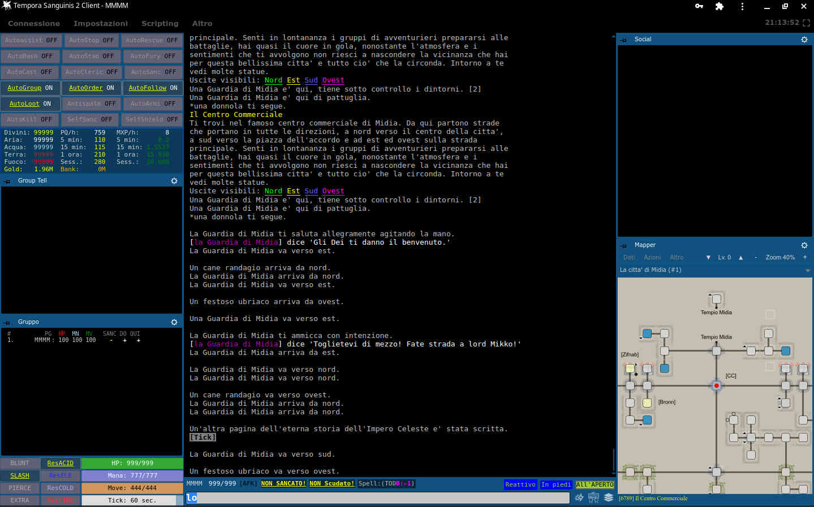

La applicazione contiene una grossa parte centrale per le risposte ricevute dal server di gioco.
Per migliorare l'esperienza di gioco è possibile aggiungere finestre flottanti (si posizionano sopra l'area centrale) o bloccate su un lato (riducono l'area centrale ma non rischiano di nasconderne il contenuto).

E' possibile:

* passare dalla versione bloccata a flottante e viceversa premendo sul simbolo della puntina da disegno presente alla sinistra del nome della finestra.
* nascondere una finestra premendo sulla X quando la finestra è in versione flottante
* mostrare una finestra selezionandola dal menu [Altro->Finestre](#MenuAltro)
* cambiare il font, la dimensione dei caratteri, posizione e dimensione della finestra premendo sul simbolo dell'ingranaggio presente sulla destra del nome della finestra

Nell'impostazione predefinita l'applicazione può essere divisa in 4 aree principali:

* [Barra dei menu](#Menu)
* [Finestre sul lato sinistro](#AreaSX)
* [Parte centrale](#AreaCX)
* [Finestre sul lato destro](#AreaDX)

## 3.1 Lato sinistro <a name="AreaSX"></a>

### 3.1.1 Riquadro dei pulsanti

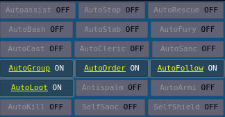

Questi pulsanti permettono di vedere quali automatismi sono attivi e quali spenti. La pressione del tasto abilita/disabilita l'automatismo.

### 3.1.2 Riquadro delle statistiche

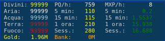

Questa compatta finestrella mostra, divise su 3 colonne, alcune informazioni utili.

Nella colonna di sinistra è indicato il numero di sigilli divini ed elementali in possesso

Nella colonna centrale c'è una statistica sul numero di Sigilli Divini ottenuti nel periodo indicato.

Nella colonna di destra c'è una statistica sugli XP ottenuti nel periodo indicato (indicati in Mega).

**Sess** rappresenta l'intera sessione (dall'avvio del client)

La riga più in basso indica le monete d'oro che si hanno sul PG (Gold) e in banca (Bank).

### 3.1.3 Riquadro delle comunicazioni del gruppo

Oltre che comparire nel riquadro dell'output di gioco, in questa finestra vengono riportate tutte le comunicazioni interne al gruppo.
Questo per permettere di non perdere alcun messaggio

### 3.1.4 Riquadro dello stato del gruppo

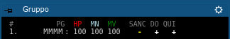

In questo riquadro sono elencati tutti i membri del gruppo (al primo posto il capogruppo). 

Per ognuno è indicato:

- PG: Il nome
- HP: Percentuale di HP
- MN: Percentuale di Mana
- MV: Percentuale di Movimento
- SANC: Presenza dell'incantesimo Sanc o equivalente
- DO: Presenza dell'incantesimo Detect Original
- QUI: Presenza del giocatore nella stessa stanza

HP, MN e MV sono indicate con colori, sottolineature e lampeggi per indicare il diverso grado di rischio.

Per SANC, DO, il **+** indica la presenza dell'incantesimo, **-** l'assenza e **!** il suo prossimo esaurimento allo scattare del tick

### 3.1.5 Riquadro delle armi e degli scudi

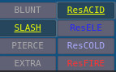

Questi pulsanti permettono di vedere quale arma (colonna di sinistra) e scudo (colonna di destra) sono indossati. La pressione del tasto permette il cambio veloce dell'arma o dello scudo.

### 3.1.6 Riquadro dello stato del pg e del tick timer

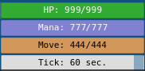

Vengono indicati e rappresentati da barre i 4 indicatori:

- HP del pg (attuali/massimi)
- MANA del pg (attuali/massimi)
- MOV del pg (attuali/massimi)
- Countdown stimato al prossimo tick

## 3.2 Parte centrale <a name="AreaCX"></a>

### 3.2.1 Riquadro dell'output del MUD

E' il riquadro principale del gioco. Contiene i messaggi ricevuti dal server di gioco

### 3.2.2 Barra di stato

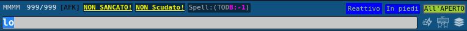

Nella riga più in alto viene indicato:

- Nome del giocatore.
- HP attuali/massimi.
- Eventuale presenza del flag [AFK] per indicare lo stato di Away From Keyboard - Allontanato dalla tastiera
- Stato del incantesimo SANC
- Stato dello scudo magico (es. fireshield)
- Stato dei buff tipici attivi sul pg (es. True Sight, Detect Original, Blink, ecc.)

e sulla destra:

- Reattivo/Laggato per indicare se il mud è pronto a ricevere comandi oppure il pg è ancora bloccato dal comando precedentemente lanciato
- Posizione del PG (In piedi/Seduto)
- Tipo di room (All'aperto/Al chiuso)

### 3.2.3 Barra delle azioni


La riga più in basso contiene il comando che si vuole mandare al server di gioco per comandare le azioni del proprio personaggio.
A seguito dell'invio il comando rimane presente e selezionato per permettere di rimandarlo con la sola pressione dell'invio.
La digitazione di un nuovo comando sostituisce il precedente.
La barra delle azioni funziona tiene uno storico degli ultimi comandi inviati che si possono scorrere usando freccia su-giù

Sulla destra sono presenti 3 pulsanti che servono per disattivare/attivare rispettivamente:

- [Triggers](#triggers)
- [Alias](#alias)
- Concatenazione di comandi separandoli da **;**

## 3.3 Lato destro <a name="AreaDX"></a>

### 3.3.1 Riquadro delle couminicazioni generali

Oltre che comparire nel riquadro dell'output di gioco, in questa finestra vengono riportate tutte le comunicazioni che il giocatore sente (tranne quelle interne al gruppo che hanno [un riquadro specifico](#AreaSX)) 
Questo per permettere di non perdere alcun messaggio.

### 3.3.2 Riquadro del mapper

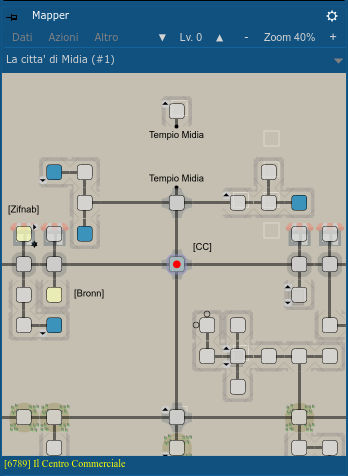

Questa riquadro contiene una rappresentazione grafica della stanza in cui si trova il giocatore (quadratino con un punto rosso tipicamente al centro della finestra) e tutte quelle attorno.
Tramite segni grafici vengono indicati i collegamenti tra le stanze, la presenza di porte e se il collegamento può essere percorso in una sola direzione.

Stanze particolari (DT, mob, trappole, teleport, ecc) vengono evidenziate con colori per renderle più velocemente individuabili.
La presenza di piccoli triangoli neri in prossimità degli angoli delle *stanze* indicano una apertura verso l'alto o verso il basso.

Il doppio click su una *stanza*, attiva il *vai automatico* fino a quella *stanza*.
Click e drag permette di spostare la mappa per vedere le parti che escono dal riquadro.

La pressione con il tasto destro su una *stanza* fa comparire un breve menu:

- **Aggiungi ai favoriti**: Permette di aggiungere la *stanza* ai favoriti attribuendole un nome. Questo permetterà di impartire al client il comando *vai nome_scelto*. Contestualmente si potrà anche impostarne anche il colore.
- **Rimuovi dai favoriti**: Rimuove la stanza dai favoriti
- **Vai**: Corrisponde ad un doppio click sulla *stanza* attivando il *vai automatico* fino a quella *stanza*
- **Posiziona**: Forza il riposizionamento del giocatore in quella *stanza*. Non prevede il movimento del giocatore.
- **Modifica**: Mostra una finestra con il contenuto (in formato JSON) del database del mapper per quella stanza per permettere modifiche locali al database. Le modifiche verranno perse quando verrà emesso e distribuito un aggiornamento.

Il mapper, vista la sua complessità, ha un suo menu specifico:

- **Dati**
    - **Modalità mappaggio**: Abilita la modalità mappaggio Usabile solo se si è capogruppo. *In sviluppo*
    - **Ricarica mappe**: Preleva da repository internet il database con le mappe.
    - **Carica da locale**: Rende attivo il database mappe che si è salvato in locale in seguito ad aver terminato la modalità mappaggio. Indispensabile perchè al riavvio il WebClient preleva la versione disponibile su internet.
    - **Scarica zona corrente**: Esporta il database della zona corrente su file in formato .json
    - **Carica zona o zone**: Importa nel database attivo la zona o le zone presenti su file esterno precedentemente esportato.
- **Azioni**
    - **Vai a num. locazione**: Attiva il *vai automatico* fino alla stanza di cui si è impostato il numero.
    - **Cerca locazione**: Permette di cercare tutte le locaziozioni il cui nome o descrizione corrisponde al criterio di ricerca messo.
    - **Sincronizza mappa**: Riposiziona il player nell'ultima stanza visitata
    - **Esporta immagine**: Permette di salvare su disco una immagine contenente tutte le *stanze* dell'area e del livello attivo.
- **Altro**
    - **Favoriti**: Mostra un elenco delle destinazioni impostate manualmente e ne permette il *vai automatico*
    - **Informazioni**: Mostra informazioni sul diritto d'uso delle mappe.
    - **Legenda**: Mostra una legenda con la spiegazione del significato degli sfondi delle *stanze*

Al centro, nella barra del menu, è indicato il livello a cui ci si trova e le 2 frecce ai lati permettono di vedere i livelli superiori o inferiori della mappa.
Sulla destra infine è indicato ed è modificabile il livello di zoom a cui si vuole vedere la mappa nel riquadro del mapper.

Appena sotto il menu è indicato il nome dell'area visualizzata. *Attenzione che il nome dell'area nel mapper non corrisponde al nome dell'area per il MUD.*

Nella parte più bassa del riquadro è indicato in numero della *stanza* in cui ci si trova e il suo nome.
E' il numero da usare con il comando *vai* per raggiungere quella stanza. 
Le stanze più frequentate e le stanze di *inizio area* hanno un nome già assegnato che è più facile da ricordare rispetto al loro numero.

# 4. Scripting <a name="scripting"></a>

Il WebClient ha un potente linguaggio di scripting che permette di velocizzare e automatizzare molti compiti.
Molti di questi automatismi che sono stati ritenuti essere di rilevanza generale per tutti e per permettere una migliore esperienza di gioco, sono già stati creati e vengono aggiornati periodicamente. Nel menu di gioco e in questo help sono chiamati **preimpostati**.
Quando è disponibile un aggiornamento il WebClient evidenzia la disponibilità e chiede conferma che si vogliono scaricare i nuovi preimpostati. Questo sovrascriverà tutti gli script preimpostati. Pertanto, pur se tecnicamente possibile, si consiglia di non modificare gli script preimpostati ma di agire solo su quelli personali.

Lo script non è altro che un elenco di comandi che il WebClient deve eseguire. Questi comandi possono riguardare il solo WebClient oppure essere comandi che il WebClient manda al MUD. 

Nella forma più semplice sono un sequenza di comandi che il WebClient deve inviare al MUD.
Per la forma più complessa si ha a disposizione JavaScript. Si rimanda a risorse esterne per tutorial sulla programmazione e sulla sintassi di JavaScript.

La spiegazione delle funzioni messe a disposizione dal WebClient sono nella sezione [Funzioni](#funzioni)

Gli script, indipendentemente dal contenuto di azioni che devono essere svolte, si dividono in 3 categorie in funzione di cosa fa partire quello script:

- [**gli alias**](#alias): script attivati da un comando impartito dal player nella riga di comando. E' sempre noto quindi quando questi script vengono attivati. Un esempio può essere l'alias ```slash``` che impartito dal player provoca il cambio dell'arma.
Un elenco e una spiegazione degli alias preimpostati è visibile impartendo il comando ```help client```
- [**i trigger**](#trigger): script attivati dalla ricezione dal server di gioco di particolari sequenze di testo. Un esempio può essere l'aggiunta automatica del player *Nome* nel gruppo alla ricezione del testo ```[Nome] inizia a seguirti```
- [**gli eventi**](#eventi): script attivati dal verificarsi della condizione impostata nell'evento. Ad esempio il cambio nel valore di una variabile. L'uso degli eventi rientra in un livello di scripting più avanzato e per le automazioni più facili è normalmente sufficiente l'uso di [alias](#alias) e [triggers](#triggers).


## 4.1 Alias <a name="alias"></a>

Gli alias sono script attivati da un comando impartito dal player nella riga di comando.

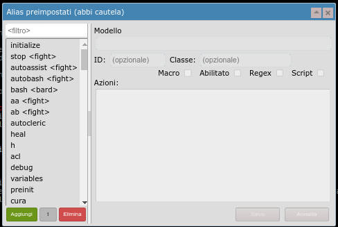

| Campo | Funzione |
| ----- | -------- |
| **Modello** | Comando che fa scattare l'alias. Qualora l'alias debba scattare in corrispondenza di più comandi è possiible definire una RegEx |  
| **ID** | Permette di attribuire un nome univoco all'alias. Questo permette agli script di riferirsi esattamente a questo alias. Ad esempio per abilitarlo o disabilitarlo. |  
| **Classe** | Permette di assegnare questo alias ad una classe. Questo permette un raggruppamento degli alias per facilitarne la ricerca. Permette inoltre agendo sull'abilitazione o disabiltiazione delle [classi](#classi), di agire contemporaneamente su tutti gli alias di quella classe. |  
| **Azioni** | Elenco dei comandi da eseguire. |  

| Flags | Funzione |
| ----- | -------- |
| **Macro** | In sviluppo. Non usare. |
| **Abilitato** | Definisce se l'alias è abilitato e quindi funzionante oppure disabilitato. |
| **Regex** | Definisce se il comando definito nel modello è un comando che deve essere impartito esattamente come scritto o se è una RegEx. Per approfondire e fere prove con le Regular Expression si consiglia il sito *https://regexr.com/* |
| **Script** | Definisce se i comandi specificati nel riquadro Azioni sono da interpretare come codice JavaScript (flag attivo) o come lista di comandi da inviare al MUD (flag spento). |

I comandi definiti nel riquadro script vengono interpretati dal client. Pertanto possono richiamare altri alias. A causa di questo c'è il rischio di avere chiamate ricorsive dove lo script richiama se stesso che richiama se stesso e così via. Questo manda in crash il client. 

Qualora serva lanciare un comando che non deve essere interpretato come alias è necessario anteporre il simbolo di tilde. Esempio: ```~comando```

### Esempio di alias facile
**Necessità**: Poichè per medicare le proprie ferite con la skill ```second wind``` è necessario essere seduti si vuole creare un atuomatismo che con l'invio di un solo comando venga svolta la sequenza: sedersi, lancio della skill, rialzarsi.

**Creazione dell'alias**

**Modello**: ```second```

**ID** e **Classe**: vuoti     **Flags**: Spunare solo il flag *Abilitato*

**Script**: 

```
sit
~second
stand
```

### Esempio di alias più complesso
**Necessità**: Castarsi le protezioni dal soffio di drago

**Modello**: ```^\+prot(a|c|f|e|l)b$```
Spiegazione della Regex:

- Comando che inizia con ```+prot```
- segue una tra le lettere a,c,f,e oppure l, che viene intercettata e assegnata al gruppo 1
- poi la lettera ```b``` 
- nulla dopo la ```b```

**ID** e **Classe**: vuoti     **Flags**: Spunare i flag *Abilitato*, *Regex* e *Script*

**Script**: 

```js
if (match[1]==="a") {  //Se la lettera passata ed intercettata nel gruppo 1 è a
    send("cast 'protection acid breath'");  //casta protezione dal soffio acid
} else if (match[1]==="c") {  //Se la lettera passata ed intercettata nel gruppo 1 è c
    send("cast 'protection frost breath'");  //casta protezione dal soffio cold
} else if (match[1]==="e") {
    send("cast 'protection gas breath'");
} else if (match[1]==="f") {
    send("cast 'protection fire breath'");
} else if (match[1]==="l") {
    send("cast 'protection electric breath'");
}
```

## 4.2 Triggers <a name="triggers"></a>

I trigger sono script attivati dalla ricezione dal server di gioco di particolari sequenze di testo.

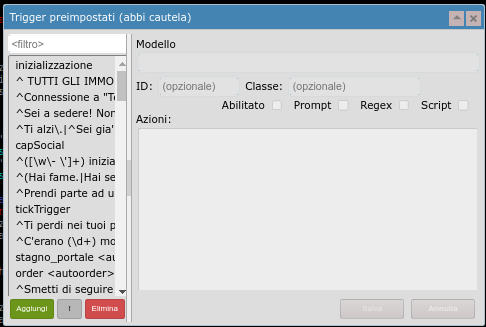

| Campo | Funzione |
| ----- | -------- |
| **Modello** | Pattern che deve essere ricevuto e che fa scattare il trigger. Qualora l'alias debba scattare in corrispondenza di più pattern possibili è possiible definire una RegEx.|
| **ID** | Permette di attribuire un nome univoco al trigger. Questo permette agli script di riferirsi esattamente a questo trigger. Ad esempio per abilitarlo o disabilitarlo.|
| **Classe** | Permette di assegnare questo trigger ad una classe. Questo permette un raggruppamento dei trigger per facilitarne la ricerca. Permette inoltre agendo sull'abilitazione o disabiltiazione delle [classi](#classi), di agire contemporaneamente su tutti i trigger di quella classe.|
| **Azioni** | Elenco dei comandi da eseguire.|

| Flags | Funzione |
| ----- | -------- |
| **Abilitato** | Definisce se il trigger è abilitato e quindi funzionante oppure disabilitato. |
| **Prompt** | Da abilitare solo se il trigger deve intercettare un pattern presente nel prompt restituito dal MUD. Altrimenti lasciare disabilitato. |
| **Regex** | Definisce se il pattern definito nel modello è un pattern che deve essere intercettato esattamente come scritto o se è una RegEx. Per approfondire e fere prove con le Regular Expression si consiglia il sito *https://regexr.com/* |
| **Script** | Definisce se i comandi specificati nel riquadro Azioni sono da interpretare come codice JavaScript (flag attivo) o come lista di comandi da inviare al MUD (flag spento).|

I comandi definiti nella finestra script vengono interpretati dal client. Pertanto possono essere richiamati altri alias. A causa di questo c'è il rischio di avere chiamate ricorsive dove lo script richiama se stesso che richiama se stesso e così via. Questo manda in crash il client.

Qualora serva lanciare un comando che non deve essere interpretato come alias è necessario anteporre il simbolo di tilde. Esempio: ```~comando```

## 4.3 Variabili <a name="variabili"></a>

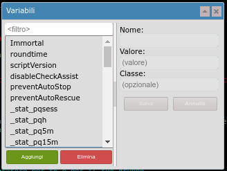

E' possibile definire variabili il cui contenuto viene salvato nel profilo del personaggio e il cui valore quindi viene mantenuto anche all'uscita del WebClient.
Queste variabili, accessibili dagli script con ```this.nome_variabile``` hanno una visibilità globale e possono essere accedute da tutti gli script (trigger, alias e eventi).
Variabili definite all'interno di script con ```let``` sono accessibili solo dallo script che le definisce.

ATTENZIONE: il contenuto di queste variabili viene tramutato in JSON per permetterne l'archiviazione nel profilo utente, questo comporta che: 

- le variabili possono contenere solo informazioni serializzabili
- le variabili non possono contenere moli di dati troppo onerose visto che lo spazio che il browser mette a disposizione è limitato.

## 4.4 Classi <a name="classi"></a>

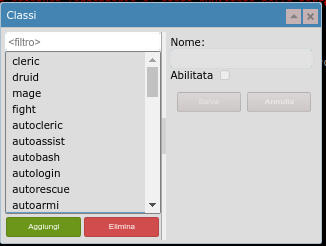

La classe è un descrittivo che può essere attribuito nel campo classe a Trigger, Alias e Eventi.

Ogni classe può poi essere abilitata e disabilitata. Questo produce la corrispondente abilitazione o disabilitazione di tutti gli script associati a questa classe.

## 4.5 Eventi <a name="eventi"></a>

Gli eventi sono tipi speciali di [Trigger](#trigger), nel senso che entrambi sono script attivati automaticamente dal WebClient al verificarsi di una condizione in gioco.
Se i [Trigger](#trigger) scattano quando il MUD manda la sequenza di testo impostata, gli eventi permettono di scattare all'accadere di altre condizioni.

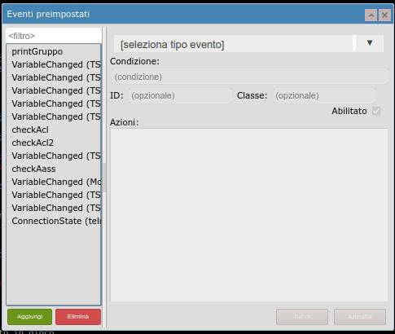


| Campo | Funzione |
| ----- | -------- |
| **Tipo di evento** | Scelta della tipologia di evento che farà scattare lo script. |
| **Condizione**| Condizione che, assieme al tipo di evento, farà scattare lo script. |
| **ID**| Permette di attribuire un nome univoco al trigger. Questo permette agli script di riferirsi esattamente a questo trigger. Ad esempio per abilitarlo o disabilitarlo. |
| **Classe**| Permette di assegnare questo trigger ad una classe. Questo permette un raggruppamento dei trigger per facilitarne la ricerca. Permette inoltre agendo sull'abilitazione o disabiltiazione delle [classi](#classi), di agire contemporaneamente su tutti i trigger di quella classe. |
| **Azioni**| Elenco dei comandi da eseguire. |

| Tipo di evento | Funzione |
| -------------- | -------- |
| **Variabile cambiata** | Lo script scatta quando la variabile impostata nel campo *Condizione* cambia il suo valore. Nello script *args* avrà il valore *oldValue* e *newValue* |
| **Stato connessione cambiato** | Lo script scatta quando la connessione al server cambia stato. in *Condizione* mettere telnet, websocket. Nello script *args* prenderà il valore true, false |
| **Impostazione cambiata** | Lo script scatta quando avviene un cambiamento delle impostazioni di *userConfig*. Indicare in *Condizione* di quale impostazione si vuole tracciare il cambiamento (text-color, wrap-lines, utf8Enabled, mxpEnabled, enable-aliases, enable-triggers, font-size, font, colorsEnabled, logTime, debugScripts) |
| **Stato classe cambiato** | Lo script scatta quando la classe impostata nel campo *Condizione* cambia il suo stato di attivazione. Nello script *args* prenderà il valore true, false |
| **Trigger scattato** | Lo script scatta quando il trigger il cui ID è impostato nel campo *Condizione* scatta. Nello script *args* prenderà il valore true, false. L'evento scatterà dopo il trigger.|


## 4.6 Funzioni disponibili <a name="funzioni"></a>

In questa sezione verranno riportate tutte le funzioni messe a disposizione dal WebClient.

## 4.7 Come fare per? <a name="howto"></a>

In questa sezione verranno aggiunte man mano le soluzioni alle domande più frequenti riguardo agli script non già riportate nelle spiegazioni precedenti.

[TODO aggiungere help per l'installazione di WebClient]